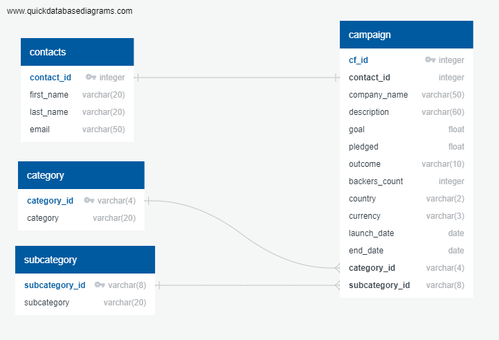

# Creating an SQL database

 ### **Overview**
Practised building an ETL pipeline using Python and Pandas to extract and transform data. After which the data was loaded into a Postgres database.

### **Aspects covered**
- Extracting and transforming data contained in excel and csv files to create new DataFrames, and exporting them as csv files.
- Creating an ERD [via QuickDBD](https://www.quickdatabasediagrams.com/) as well as database schema.
- Creating a new Postgres database
- Using the database schema and creating the tables in the correct order to handle the foreign keys
- Importing each csv into its corresponding SQL table
- Verifying each table has the correct data by running select statements for each

### **Folder structure**
- '*ETL_Mini_Project_KColeman.ipynb*' contains the code for extracting, transforming and exporting the csv files for the project.
- The folder '**Resources**' contains the two original files used in the project (*'contact.xlsx'* and *'crowdfunding.xlsx'*) as well as the four newly created csv files:
  1. category.csv
  2. subcategory.csv
  3. campaign.csv
  4. contacts.csv
- *crowdfunding_erd.png* contains the entity relationship diagram.
- '*crowdfunding_db_schema.ipynb*' contains the code used to create the tables, verify table creation, import the relevant csv files, and verify each table has the correct data.

 

---

### **Contact**
Email: kymcoleman@gmail.com

---